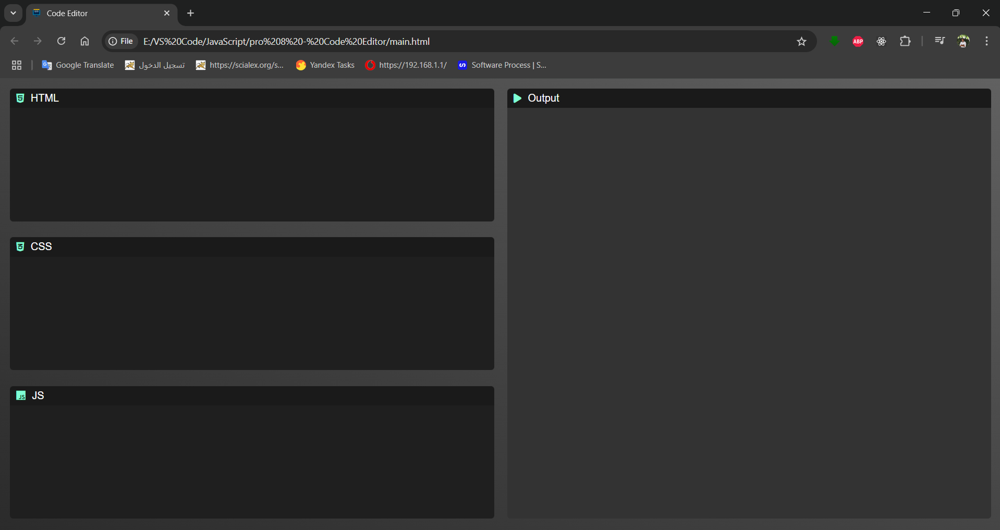

# 🧠 Live Code Editor

A **simple, in-browser code editor** for writing and previewing HTML, CSS, and JavaScript in real-time. This project allows users to experiment with web technologies and see instant results in the output pane.

## 🚀 Features

* 🔤 Live preview of **HTML**
* 🎨 Apply **CSS** styles instantly
* ⚙️ Run **JavaScript** on the fly
* 🎭 Font Awesome icons for intuitive UI
* 🌓 Dark-themed responsive design
* 🖥️ Output rendered in an `<iframe>`

## 📁 Project Structure

```
code-editor/
│
├── index.html       # Main HTML file
├── main.css         # Styling for layout and design
├── main.js          # JavaScript logic for live code rendering
├── code2.png        # Favicon (optional)
└── README.md        # Project documentation
```

## 🛠 How It Works

* The UI is split into two main sections:

  * **Left Panel**: Three `textarea` boxes for HTML, CSS, and JavaScript input.
  * **Right Panel**: Displays the live output using an `iframe`.
* As you type, the `run()` function updates the output:

  * HTML and CSS are injected into the iframe.
  * JavaScript is executed via `eval()` in the iframe context.

## 🖼 Screenshot



## 🧰 Technologies Used

* **HTML5**
* **CSS3**
* **JavaScript (ES6)**
* **Font Awesome CDN** for icons

## 📦 Setup Instructions

1. Clone the repository or download the files:

   ```bash
   git clone https://github.com/yourusername/code-editor.git
   ```
2. Open `index.html` in your browser.
3. Start typing code and see the live preview instantly.

## ⚠️ Note

* This project uses `eval()`, which can be a security risk. It’s recommended only for learning or personal use.
* Not suitable for production use without additional input validation or sandboxing.

## 🙌 Acknowledgements

* Font Awesome for providing icons.
* Inspired by online tools like JSFiddle and CodePen.
